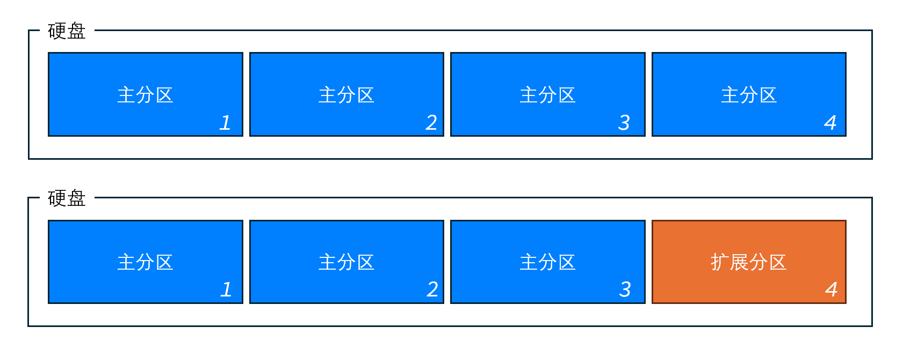
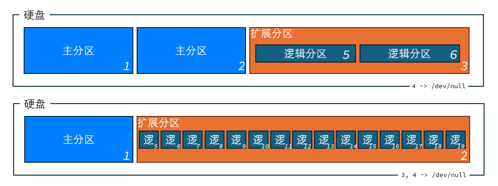
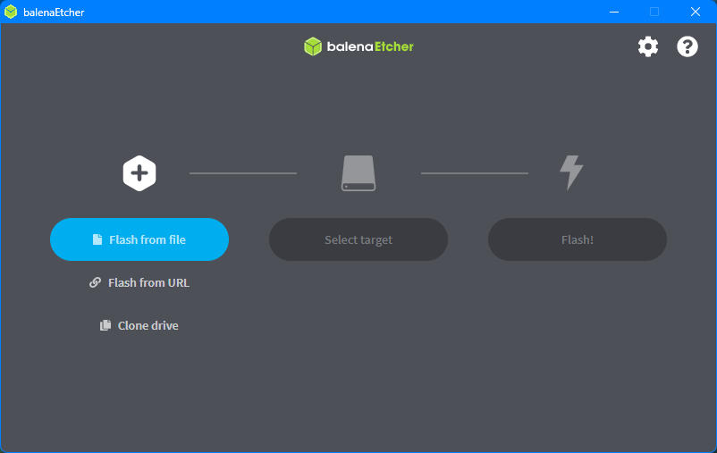
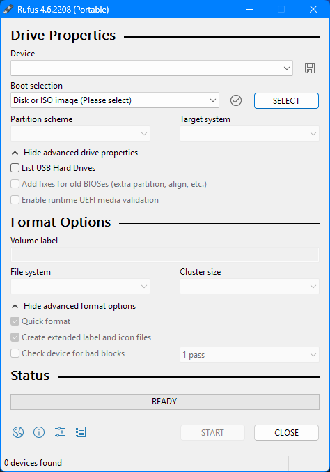
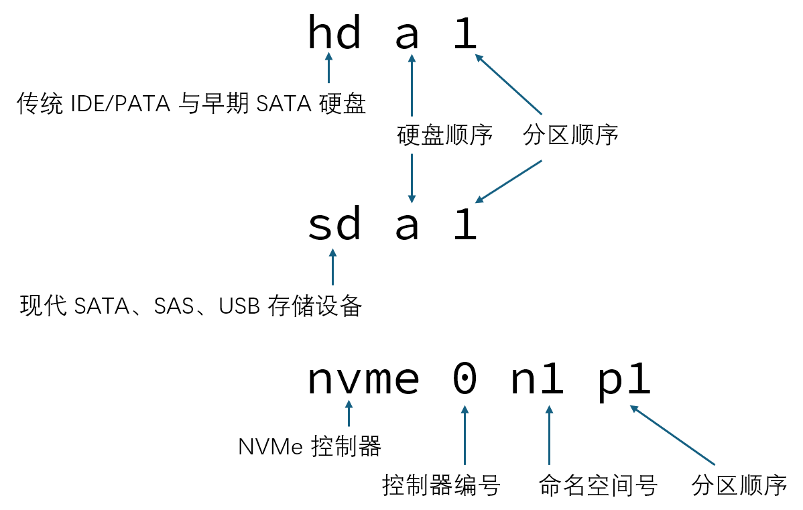
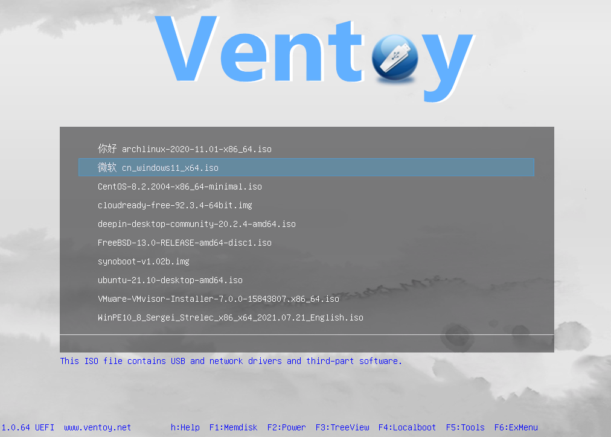
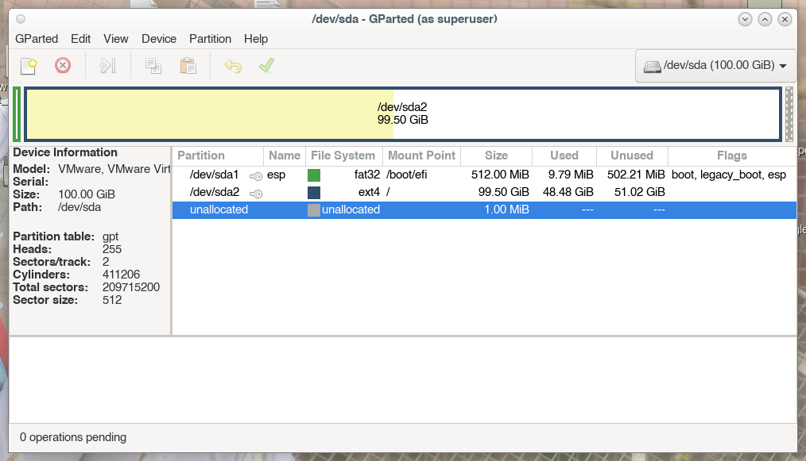

# Re: 从零开始的 Live CD 制作和安装过程

以 CC BY-NC-SA 4.0 许可证授权

[[_TOC_]]

## 0. 相关概念解释

### 0.1 Legacy BIOS 与 UEFI

#### 0.1.1 区别

| 比较项 | Legacy BIOS | UEFI |
| -- | -- | -- |
| 分区表 | MBR | GPT |
| 支持硬盘大小 | 2.2 TB (≈ 1.9999 TiB) / 4 个主分区 | 9.4 ZB（理论上） |
| 安全性​ | 基本无 | 支持安全启动（Secure Boot） |
| 启动速度​ | 通常较慢 | 通常更快，支持并行初始化硬件 |

#### 0.1.2 MBR 分区方案中各种分区之间的关系

- 主分区和扩展分区相互独立；扩展分区专门容纳逻辑分区（GPT 方案则完全没有这种概念，所有的分区都是主分区）
- 只有主分区能在 BIOS 阶段可被引导
- 最多只能有 4 个主分区或者 3 主 + 1 扩（即扩展分区最多只能有 1 个）
- Linux 中，主分区/扩展分区的分区号为 1~4，逻辑分区只能从 5 开始

以下是更直观的比较：





#### 0.1.3 何时使用 Legacy BIOS 或 UEFI？

2012 年之后生产的 PC **普遍支持 UEFI 启动**，且随着硬件能力的增强，Legacy BIOS 的短板也越来越明显，所以在非特殊情况下，优先采用 UEFI 启动。

**优先使用 UEFI**：
- 要利用的单硬盘容量大于 2.2 TB
- 要安装很多系统，要划分好多分区，又希望这些分区能方便管理
- 安装现代的操作系统
- 要使用的硬盘正在采用 GPT 作为硬盘分区表
- 使用到了 NVMe SSD 等新硬件

**优先使用 Legacy BIOS**：
- 不支持 UEFI 启动
- 安装旧的操作系统
- 当前硬盘采用 MBR 作为硬盘分区表

#### 0.1.4 UEFI 与 Legacy 双兼容原理

通常 UEFI 的 BIOS 包含了 **CSM**，即**兼容性支持模块**，提供了对不支持 UEFI 的系统和硬件（如较旧的显卡、硬盘、扩展设备、OS 等）在 UEFI 启动环境下的兼容性支持。然而不是所有的 PC 都能提供完整的 CSM 支持，比如像是部分笔记本电脑，仅支持外部存储的 CSM 而不支持内部存储，而有的硬件设备（如红绿两厂的显卡、'25 年之后的主板等）和操作系统（如 Windows 11）甚至已经完全不支持 CSM 了。

**为什么要了解这个？**

有的操作系统安装盘支持 Legacy 和 UEFI 双兼容引导，而在启动 Live CD 后，可能不能正确报告系统的启动方式，即不知道它是 Legacy 还是 UEFI 启动。

这就出现了一个问题：Legacy BIOS 与 UEFI 采用了不同的硬盘分区表，这可能会给多系统安装带来麻烦。

比如之前从 Legacy 启动的 Live CD 安装完的系统就是 MBR 的分区表，而有个从 UEFI 启动的 Live CD 要将整个硬盘的分区表改为 GPT，与 Legacy BIOS 的 MBR 完全不兼容，于是就要清除掉这个硬盘的所有分区，再重新创建一个 GPT 分区表，这就会导致文件丢失，很麻烦。

这里给出一个建议：如果决定好只使用 UEFI，那么就要在 BIOS 中关闭或禁用 CSM 模块或者 Legacy 支持，并去除不兼容设备；反之，确保所有需要的设备、软硬件都应兼容 CSM。

**那么以后 CSM 怎么说？**

随着硬件的发展，CSM 的支持程度正在快速下降，整体呈现逐步淘汰的趋势。根据微软推动的技术标准，2025 年后新设备将默认关闭 CSM，UEFI Class 3 标准将彻底淘汰 Legacy BIOS。虽然主流 Linux 发行版对 UEFI 支持良好，但是以后新硬件和操作系统都在向纯 UEFI 模式转型，主流平台淘汰 Legacy BIOS 和 CSM 将是趋势，旧硬件平台亦要做好过渡和升级的准备。

### 0.2 启动流程

#### 0.2.1 Legacy BIOS 引导

BIOS 初始化 -> 按设置指定顺序查找可引导硬件 -> 读取主引导记录（MBR） -> 执行 MBR 代码 -> 找到标记为 “活动” 的主分区 -> 读取该活动分区的第一个扇区（操作系统引导扇区） -> 引导扇区程序加载 OS 核心启动文件

#### 0.2.2 UEFI

BIOS 初始化 -> 按设置指定顺序查找可引导硬件 -> 查找 ESP 分区 -> 查找 ESP 分区内 `.efi` UEFI 应用程序 -> 运行 `.efi` 引导加载程序 -> 加载 OS 内核并初始化系统

### 0.3 龙芯生态中的 “新旧世界”

使用龙芯架构的处理器时，您可能会注意到对于这个架构的处理器的两种名称表达：“LoongArch64” 和 “Loong64”，而围绕着前者的生态体系被称为 “旧世界”，后者则是 “新世界”。出现这两种名称，主要源于两个层面的历史原因：**开源社区的命名分歧**和更关键的 **ABI（应用二进制接口）新旧世界差异**。

**LoongArch64** 是龙芯官方对 64 位龙架构的完整称呼。但在融入全球开源生态的过程中，部分社区（如 Go 语言、Debian 系发行版）认为名称过长，在命令行、编译参数中不便使用，便将其简化为 **loong64**。这就导致了不同工具链和发行版采用了不同的名称。这种命名不统一**本身不会导致二进制指令不兼容**，但会造成软件包管理工具（如 `dpkg`、`rpm`）误判软件包与系统架构不符，从而阻止安装。

而真正会出现的兼容性问题，是这两个 ABI 在寄存器使用约定、栈帧对齐、系统调用等底层接口上存在差异。因此，针对新世界 ABI（loong64）编译的程序，无法直接在旧世界系统（loongarch64）上运行，反之亦然，常表现为段错误（Segmentation Fault）或安装被拒绝。

随着生态逐步统一到新世界 ABI，此类问题预计会逐渐减少。

更多资料，参见相关专题网站：<https://areweloongyet.com>

## 1. 准备并制作一个 Live CD 启动盘

为了兼容 Legacy BIOS 设备，尤其确保 MBR 内容的准确写入，最好确保扇区一对一地将 ISO 镜像内容写入到启动设备。

### 1.1 直接做成单个镜像盘

#### 1.1.1 制作成光盘

Windows 中可以直接使用系统文件管理器自带的刻录工具：

1. 在主机的刻录机中插入空白 CD/DVD。
2. 右键点击下载好的 ISO 文件，在右键菜单中选择 “刻录光盘映像”。
3. 确认刻录机和光盘后，点击 “刻录” 开始刻录过程。
4. 坐和放宽。
5. 等待光驱弹出。

Linux 中可以使用特定命令行或图形工具。目前暂无比较好的通用方法，请自行搜索。

#### 1.1.2 制作成 U 盘镜像

Winndows 中需使用第三方工具：balenaEtcher 或 Rufus。Linux 则可以使用 `dd` 命令直接将 ISO 文件写入到设备。

##### 1.1.2.1 balenaEtcher



1. 插入 U 盘，启动 balenaEtcher。
2. 点击 “Flash from file”，选择一个 ISO 镜像文件。
3. 点击 “Select target”，选择一个要写入的目标 U 盘。
4. 点击 “Flash!”，等待写入完成。

##### 1.1.2.2 Rufus



1. 插入 U 盘，启动 Rufus。
2. 选好设备，将引导类型选为 “Disk or ISO image”，并选择一个镜像。
3. 视需要勾选 “Add fixes for old BIOSes”，其余选项也可按需调整。
4. 点击 “START”，等到写入完成。

##### 1.1.2.3 `dd` 命令

1. 插入 U 盘。
2. 如系统自动挂载了分区，需卸载所有被被自动挂载的 U 盘内的分区。
3. 执行 `lsblk -f` 查看这个 U 盘对应的设备名。
4. 执行以下命令：

```bash
sudo dd if=/path/to/your.iso of=/dev/sdX bs=4M status=progress conv=fsync
## 待写入完成后，让 Linux 内核立刻将所有脏数据写回外存
sudo sync
## 安全关闭设备电源并弹出
sudo udisksctl power-off -b /dev/sdX
```

其中 `/dev/sdX` 替换为实际的设备名。对于 `sd` 开头的设备名，其后不要加数字，设备名只需要写到硬盘设备而不是分区，比如 `sdb`、`nvme0n2` 是对的，而 `sdb1`、`nvme0n2p1` 是错的。



5. 直接拔出设备。

### 1.2 多镜像切换方案

这里介绍一种多镜像切换方案：**Ventoy**。

Ventoy 的方便之处在于：可以直接往设备中复制多个镜像文件而无需制作硬件启动盘，而且可以在多个启动镜像中切换，支持多种架构及 OS 发行版。



支持的架构如下：

| 启动类型 | x86_64 | i386 | arm64 | mips64el | loongarch64 |
| -- | :--: | :--: | :--: | :--: | :--: |
| Legacy | × | ○ | × | × | × |
| UEFI | ○ | ○ | ○ | ○ | × |

#### 1.2.1 制作 Ventoy 启动盘

这里以 Ventoy2Disk GUI 工具为例。

1. 去 <https://github.com/ventoy/Ventoy/releases> 下载 Ventoy 启动盘制作工具。
2. 启动 Ventoy2Disk GUI 工具。
3. 如有需要，可在 “Option” 菜单里更改所需配置。
4. 选择需要安装 Ventoy 的设备。
5. 点击 “安装”。
6. 安装完成后可直接拔出，或者挂载 Ventoy 存储盘（一般是容量较大、文件系统为 exFAT 的）开始复制镜像了。

## 2. 启动 Live CD

### 2.1 从启动盘引导

#### 2.1.1 插入启动盘

对于 U 盘等移动存储设备，可在开机前插入。

光驱只能在通电时弹出（除非特殊主板，或 BIOS 中另外设置），所以在开机后立即弹出光驱、插入光盘再关仓。

#### 2.1.2 配置引导设置

有的 BIOS 自检时会有一段倒计时，允许用户在倒计时内按下指定按键中断正常启动、执行其他功能；大多数 PC 可以调出引导菜单，由此优先引导启动盘设备。

应在倒计时之前按下这个调出引导菜单的按键至少一次，或者从开机后就反复按这个按键直到进入引导菜单。如果不清楚，有的机型会在屏幕上提示。

如果有的 PC 没有这种按键，就需要在 BIOS 设置中修改引导顺序。

部分常见厂商 PC 的引导菜单快捷键如下：

| 厂商 | BIOS 设置 | 引导菜单 |
| -- | :--: | :--: |
| Dell | `F2` | `F12` |
| VMware (Legacy BIOS) | `F2` | `Esc` |
| VMware (UEFI) | | `Del`, `Esc`, `F2` |
| 华为 | `F2` | `F12` |
| 联想开天 | `F1` | `F12` |
| 清华同方 | `Esc` | `F3` |
| 曙光 | `Del` | |

#### 2.1.3 进入启动盘

引导到这个启动盘后，首先进入的是启动管理器界面，如 GRUB，可以选择所需的系统或参数启动。

不同 Live CD 提供的启动项可能不同，但是通常允许用户使用或者直接安装。

## 3. 分区

### 3.1 常见分区种类

| 用途 | 挂载点 | 标识 | 常用文件系统 | 说明 |
| -- | -- | -- | -- | -- |
| 根分区 | `/` | Linux partition | ext4, ext3, btrfs, xfs 等 | 系统核心文件所在，必须存在 |
| boot 分区 | `/boot` | Linux partition | ext4 | 存放内核和引导文件，可用于 Legacy 或复杂分区 |
| home 分区 | `/home`, `/data` | Linux partition | ext4, ext3, btrfs, xfs 等 | 用户个人数据，独立后可方便系统重装 |
| 交换分区​ | | Linux swap | swap | 用作虚拟内存，可作为文件形式单独存在 |
| EFI 分区 | `/boot/efi` 或 `/efi` | EFI system partition | vfat (fat16, fat32, etc.) | （UEFI 必需）存放引导程序 |
| boot 分区 (Arch Linux 系) | `/boot` | EFI system partition | vfat (fat16, fat32, etc.) | （UEFI 必需）存放引导程序、Linux 内核和引导文件等；自身包含 `/boot/efi` 目录 |

另：**分区标识和文件系统有什么不同**？

- 分区标识是写在分区表（如 MBR 或 GPT）中的 “类型标签”，是给系统引导程序或工具看的 “类型说明”，告诉计算机这个分区是干什么用的，用于快速识别分区。

- 文件系统是写在分区内部的 “数据组织结构”，告诉操作系统如何存放和读取文件。

### 3.2 常见分区布局

以下均默认采用 GPT 分区表，且支持 UEFI 启动；如只支持 MBR 分区表和 Legacy 启动，无需创建 `/boot/efi` 分区（但是只有 `/boot/efi` 没有 `/boot` 时，用 `/boot` 代替 `/boot/efi`），且要注意安装时，主引导记录（第一个可启动磁盘的第一个扇区）内容正确且没被破坏。

#### 3.2.1 最简单布局

| `/boot/efi` | `/` |
| ----------- | --- |

其中，对于 Arch Linux 系发行版：

| `/boot` | `/` |
| ------- | --- |

#### 3.2.2 常见的、普适性布局

| `/boot/efi` | `/boot` | `/` | `swap` |
| ----------- | ------- | --- | ------ |

#### 3.2.3 Gentoo 系发行版推荐布局

| `/boot` | `swap` | `/` |
| ------- | ------ | --- |

其中，`/boot` 分区格式化为 vfat 文件系统，与 Arch Linux 类似。

#### 3.2.4 将个人数据分离的、含备份的（国产发行版式）布局

| `/boot/efi` | `/boot` | `/` | `/backup` | `/data` | `swap` |
| ----------- | ------- | --- | --------- | ------- | ------ |

| `/boot/efi` | `/boot` | `/` | `/home` | `swap` |
| ----------- | ------- | --- | ------- | ------ |

| `/boot/efi` | `/boot` | `/` | `/data` | `swap` |
| ----------- | ------- | --- | ------- | ------ |

至于那些个乱七八糟的 Kylin V11、UOS 25 式分区布局……太乱了，我不想骂了（）

#### 3.2.5 多 Linux 系统分区

| `/boot/efi` | `/boot` | `/` | `/boot` | `/` | `/boot` | `/` | `swap` |
| ----------- | ------- | --- | ------- | --- | ------- | --- | ------ |

| `/boot/efi` | `/` | `/` | `/` | `swap` |
| ----------- | --- | --- | --- | ------ |

### 3.3 如何分区

这里介绍以下几款分区管理工具。

#### 3.3.1 fdisk

fdisk 是常用的分区工具，采用交互式菜单操作，命令不会立即生效，直到写入（write）为止。

1.  **启动工具**：`sudo fdisk /dev/sdX` （例如 `/dev/sda`）
2.  **查看分区表**：输入 `p` 打印当前分区信息。
3.  **创建新分区**：
    - 输入 `n` 创建新分区。
    - 选择分区类型（主分区 `p` 或扩展分区 `e`）。
    - 设置起始扇区（通常直接回车用默认值）。
    - 设置结束扇区或分区大小（如 `+20G` 表示创建 20 GB 的分区）。
4.  **修改分区类型**：输入 `t`，选择分区号，输入类型代码（如 `83` 是 Linux）。
5.  **删除分区**：输入 `d`，选择要删除的分区号。
6.  **保存并退出**：输入 `w` 将更改写入磁盘并退出。**（谨慎操作，一旦写入无法撤销）**
7.  **放弃更改**：输入 `q` 不保存任何更改直接退出。

**关键提示**：操作完成后，通常需要运行 `partprobe` 或重启系统让内核重新读取分区表，然后使用 `mkfs` 命令在新分区上创建文件系统。

#### 3.3.2 cfdisk

`cfdisk` 是 `fdisk` 的文本用户界面前端，允许用户在不记忆大量指令的情况下，仅通过方向键和部分输入来处理分区操作。部分快捷键与 `fdisk` 的定义相似。其界面大致如下：

```
                                    Disk: /dev/sda
                 Size: 100 GiB, 107374182400 bytes, 209715200 sectors
             Label: gpt, identifier: 89ABCDEF-4567-0123-EFCD-AB89670080FF

    Device              Start           End       Sectors      Size Type
>>  /dev/sda1            2048       1050623       1048576      512M EFI System
    /dev/sda2         1050624     209713151     208662528     99.5G Linux filesystem


 ┌────────────────────────────────────────────────────────────────────────────────────┐
 │ Partition name: esp                                                                │
 │ Partition UUID: 67452301-AB89-EFCD-0123-45678966CCFF                               │
 │ Partition type: EFI System (C12A7328-F81F-11D2-BA4B-00A0C93EC93B)                  │
 │     Attributes: LegacyBIOSBootable                                                 │
 │Filesystem UUID: 0066-CCFF                                                          │
 │     Filesystem: vfat                                                               │
 │     Mountpoint: /boot/efi (mounted)                                                │
.└────────────────────────────────────────────────────────────────────────────────────┘
   [ Delete ]  [ Resize ]  [  Quit  ]  [  Type  ]  [  Help  ]  [  Write ]  [  Dump  ]

          Device is currently in use, repartitioning is probably a bad idea.
                         Quit program without writing changes
```

#### 3.3.3 GParted

GParted 是 GNU Parted 的一个图形前端，支持比 `fdisk` 更多、更灵活的功能，如分区的扩缩、移动等，以及分区在线时的直接编辑。



### 3.4 分区格式化

创建分区之后不能直接使用，还需要按需格式化分区。可以使用 `util-linux` 提供的各种分区格式化工具。

常见文件系统的格式化工具及命令如下：

| 文件系统 | 命令 | 备注
| -- | -- | -- |
| fat32 | `mkfs.fat -F 32 /dev/your_partition` | |
| fat16 | `mkfs.fat -F 16 /dev/your_partition` | |
| ext4 | `mkfs.ext4 /dev/your_partition` | |
| ext3 | `mkfs.ext3 /dev/your_partition` | |
| btrfs | `mkfs.btrfs /dev/your_partition` | |
| xfs | `mkfs.xfs /dev/your_partition` | |
| exfat | `mkfs.exfat /dev/your_partition` | 可能需要安装 `exfatprogs` 工具包 |
| ntfs | `mkfs.ntfs /dev/your_partition` | 可能需要安装 `ntfs-3g` 工具包 |
| swap | `mkswap /dev/your_partition` | |

### 3.5 其他分区类型

以下几种分区类型可能会在安装某些 Linux 发行版时遇到，但是不常用，故不再赘述：

- **LVM (logical volume manager)**：Linux 的一种磁盘管理机制，可将硬盘或分区抽象称一个 “存储池”，在这个池中按需创建、调整或删除 “逻辑卷”，从而更灵活地管理存储空间。当需要频繁、灵活地调整多个分区的大小，或者使用快照功能、或将多个硬盘合并成一个统一的大存储空间来使用的话，可以考虑使用。
- **RAID**：是 “独立磁盘冗余阵列” 的缩写，它是一种将多块物理硬盘组合起来，作为一个逻辑单元使用的技术，主要目的是提升数据存储的性能和/或可靠性

## 4. 安装

我们遇到的 Linux 发行版基本都有向导式、半自动的安装流程，且每个发行版的安装过程大同小异（除了极个别的 Linux 发行版分支），故此处略。

## 5. 安装后可能遇到的常见启动问题

### 5.1 系统没有起来，但是想通过 Live CD 看看我的系统里面是怎么回事

| BIOS 引导过程 | 启动管理器过程 | 系统启动过程 |
| :--: | :--: | :--: |
| 正常 | 不确定 | 不确定 |

1. 启动到 Live CD 的系统。
2. 挂载以下虚拟文件系统：

```bash
## 假设你要挂载的目标路径是 `/mnt`
sudo mount /dev/sdXy /mnt
sudo mount --bind /proc /mnt/proc
sudo mount --bind /sys /mnt/sys
sudo mount --bind /dev /mnt/dev
## 对于现代系统，通常也建议挂载 `/dev/pts` 和 `/run/shm`
sudo mount --bind /dev/pts /mnt/dev/pts
sudo mount -t tmpfs shmfs /mnt/dev/shm
```

3. 复制 DNS 解析配置（可选但推荐）。

   为了让 `chroot` 环境能正常解析域名（例如使用 apt），需要将宿主机的 `/etc/resolv.conf` 复制到目标系统。

```bash
sudo cp /etc/resolv.conf /mnt/etc/resolv.conf
```

4. 设置环境变量（可选但推荐）。
   
   在 `chroot` 后，可以设置一个清晰的提示符，并确保 `PATH` 变量包含常用路径。

```bash
sudo chroot /mnt
```
```bash
export PS1="(chroot) $PS1" # 修改提示符，明确当前在 chroot 环境
export PATH=/usr/local/sbin:/usr/local/bin:/usr/sbin:/usr/bin:/sbin:/bin
```

5. 操作完成后，务必记得卸载这些挂载点 ~~（忘了通常也没事，系统关闭时也会自动卸载）~~：

```bash
sudo umount /mnt/proc
sudo umount /mnt/sys
sudo umount /mnt/dev/pts
sudo umount /mnt/dev/shm
sudo umount /mnt/dev
sudo umount /dev/sdXy /mnt
```

### 5.2 没有正常启动，进入了 GRUB shell

| BIOS 引导过程 | 启动管理器过程 | 系统启动过程 |
| :--: | :--: | :--: |
| 正常 | 异常 | 不确定 |

如果 GRUB 启动时出现了一些小问题，可能会进入下面的这个 GRUB shell：

```
                    GNU GRUB  version 2.12-9+deb13u1

   Minimal BASH-like line editing is supported. For the first word,
   TAB lists possible command completions. Anywhere else TAB lists
   possible device or file completions. To enable less(1)-like
   paging, "set pager=1".


grub> _
```

更严重的情况下，可能还会进入功能更有限的救援（rescue shell）：

```
grub rescue> _
```

这表明系统可能**没有完全正确**安装 GRUB 启动器，或 GRUB 启动器的部分文件有损坏。如果系统的 GRUB 配置、Linux 内核和 `/boot` 目录分区还完好无损的话，还是可以启动到系统。

以下提供两种临时进入系统的方法：

#### 5.2.1 临时恢复正常 GRUB 界面

可以尝试用以下命令进入正常的 GRUB 菜单界面：

```grub-shell
## 列出所有分区、GRUB 进程目录和内存盘目录
ls
## 其输出类似于：`(proc) (memdisk) (hd0) (hd0,gpt2) (hd0,gpt1)`
## 其中，`hdX` 是硬盘号
## `gptX` 或 `msdosX` 是分区号，前者代表 GPT，后者代表 MBR

ls (hd0  ## 此时按下 tab，将列出这个硬盘中所有分区的详细信息，包括文件系统、UUID、分区位置及大小等

## 然后需要确保知道两点：
## 一个包含 `/boot` 分区或目录的分区号（这里假设为 `(hd0,gpt2)`）、
## 和包含 GRUB 配置信息的目录（这里假设为 `(hd0,gpt2)/grub`）

## 设置 GRUB 环境的根目录
set root=(hd0,gpt2)
## 将 GRUB 配置文件目录作为前缀
set prefix=(hd0,gpt2)/grub
## 初始化 normal（正常启动）模块
insmod normal
## 启动 normal 模块
normal
```

#### 5.2.2 直接手敲命令启动到 Linux 系统

```grub-shell
## 查看可用分区
ls
## 设置根分区（根据实际情况调整，如 `(hd0,msdos1)` 或 `(hd0,gpt2)`）
set root=(hd0,gpt2)
## `(hd0,gpt2)` 对应 `/boot` 目录所在分区，根据实际情况调整

## 加载内核：
## 需要替换为实际内核名、initrd 名和 Linux 根分区号
## 内核名、initrd 名因不同发行版策略而异
## 其中以下内核参数可选，对内核调试有帮助：
## `loglevel=X`: 内核日志输出详细级别，最大为 7，最小为 0，通常可以设为 3 或 4
## `sysrq_always_enabled=1`: 始终启用 SysRq 魔法快捷键，可在系统无响应（但还没有 panic）时直接与内核通信，执行一些底层操作
linux /boot/vmlinuz-VERSION-ARCH root=/dev/sda2 ro loglevel=4 sysrq_always_enabled=1

## 加载 initrd 镜像
initrd /boot/initrd.img-VERSION-ARCH

## 启动系统
boot
```

### 5.3 LoongArch64 的电脑无法引导到一个同为 LoongArch64 的启动盘

| BIOS 引导过程 | 启动管理器过程 | 系统启动过程 |
| :--: | :--: | :--: |
| 异常 | 不确定 | 不确定 |

检查：

- **启动盘有没有正确制作**：

  验证启动盘介质或镜像是否正常，或在同架构机器上测试。

- **镜像系统是否为 Loong64 而不是 LoongArch64 架构**：

  虽然实际上指的是同一个架构，但是有些电脑的 BIOS 较旧，会认为 Loong64 不是自己兼容的架构，从而拒绝引导到启动盘系统。

  如果可以的话，请优先考虑升级此设备的 BIOS 固件。

  相关概念的解释，请参见 0.3 节。

### 5.4 装了一个新系统，保留的旧系统启动不了了

| BIOS 引导过程 | 启动管理器过程 | 系统启动过程 |
| :--: | :--: | :--: |
| 正常 | 异常 | 不确定 |

可能在新系统安装的过程中，发生了以下情况的其中一种或多种。

以 Debian 系发行版为例，请依次检查新系统中：

- **是否正确安装软件包 `os-prober`**：

  以 Debian 系为例，执行以下命令安装 `os-prober`：

  ```bash
  sudo apt install os-prober     ## 安装
  sudo apt reinstall os-prober   ## 或重新安装
  ```

- **是否在 GRUB 配置中禁用了相关设置**：

  检查文件 `/etc/default/grub` 的内容，看 `GRUB_DISABLE_OS_PROBER` 选项是否被注释或赋值非 `false`：

  ```
  # If your computer has multiple operating systems installed, then you
  # probably want to run os-prober. However, if your computer is a host
  # for guest OSes installed via LVM or raw disk devices, running
  # os-prober can cause damage to those guest OSes as it mounts
  # filesystems to look for things.
  #GRUB_DISABLE_OS_PROBER=false  ## ← 这里，解除注释并赋值 `false`
  ```

- **该分区的 UUID 是否被修改**：

  安装新系统时，这个分区的 UUID 可能会被那个安装程序修改了，但是没有及时更新 GRUB 启动器配置，导致这个分区找不到了，从而找不到内核文件及根分区，随即启动失败。

  在文件 `/boot/grub/grub.cfg` 里，这个系统的启动项中有以下代码用来唯一标识并找到系统的根分区：

  ```grub
  ## ...
  ## 注意以下命令中含有十六进制字符串的内容，这个可能就是根分区的 UUID
  ## 看这个分区的 UUID 能不能跟实际分区的 UUID 对上
  if [ x$feature_platform_search_hint = xy ]; then
      search --no-floppy --fs-uuid --set=root --hint-bios=hd0,gpt2 --hint-efi=hd0,gpt2 --hint-baremetal=ahci0,gpt2  67452301-ab89-efcd-0123-45678966ccff
  else
      search --no-floppy --fs-uuid --set=root 67452301-ab89-efcd-0123-45678966ccff
  fi
  echo    'Loading Linux ...'
  linux   /boot/vmlinuz root=UUID=67452301-ab89-efcd-0123-45678966ccff ro  loglevel=4 sysrq_always_enabled=1
  ## ...
  ```

- **最终**：

  确保其他系统没有使用 LVM 或其他文件系统的情况下，执行 `sudo update-grub` 更新 GRUB 启动器配置文件。

### 5.5 Loongnix (Server) 提供的 GRUB 无法启动其他 Linux 系统

| BIOS 引导过程 | 启动管理器过程 | 系统启动过程 |
| :--: | :--: | :--: |
| 正常 | 异常 | 不确定 |

#### 5.5.1 现象

当使用由 Loongnix 提供并安装的 GRUB 启动器启动到其他的 Linux 时，可以观察到，GRUB 虽然加载了这个系统的 Linux 内核和 initrd，但是并没有继续启动（`jmp`），而是回到了 GRUB 菜单。

#### 5.5.2 分析

Loongnix 这个版本的 GRUB 可能有问题。

通常 GRUB 对每一个启动项最后都会隐式地执行命令 `boot`，但是在这个版本中，每一个启动项最后都没有隐式执行 `boot`。

然而，在生成自身启动项的脚本 `10_linux` 中，会输出显式执行 `boot` 的命令，所以与其他 OS 不同，通过这种优化方式，这一版 Loongnix “规避” 了这个问题，使自身的这个 OS 能继续启动。说明：Loongnix 针对这个问题只对自身的 OS 做了优化，而在 os-prober 配置脚本 `30_os-prober` 中没有对 os-prober 探测到的 OS 做同样的优化。

#### 5.5.3 解决方法

**方案 1**：修改 GRUB 启动器配置文件（临时方案，非长久之计）

这个文件可能位于 `/boot/grub.cfg`, `/boot/grub2/grub.cfg` 或 `/boot/grub/grub.cfg`。可以在修改前做好备份。要确保修改后的文件，所有者仍然是 `root:root` 且权限是 `600`。

每一个启动项，在配置文件中都是类似这样的形式：

```grub
menuentry 'DistroName Linux' --options option_values {
        ## some other initialization command...
        ## 以下两条命令的操作都只是分别向加载了 Linux 内核和初始化内存盘
        ## 但是 Loongnix 的 GRUB 执行之后不会立即开始引导
        linux /boot/vmlinuz root=UUID=67452301-ab89-efcd-0123-45678966ccff ro
        initrd /boot/initramfs.img
}
```

如果这个启动项的最后一行缺少 `boot`，给它加上。

> [!warning] 注意
> GRUB 的配置文件被设计为只能通过程序更新其中的内容，而不是由人类手动更新。正如这个配置文件的开头所说：
> ```
> #
> # DO NOT EDIT THIS FILE
> #
> # It is automatically generated by grub-mkconfig using templates
> # from /etc/grub.d and settings from /etc/default/grub
> #
> ```
> 
> 如果触发了 GRUB 配置文件的更新操作，那么所有在这个文件中的修改都会丢失，所以这不是长久之计。采用这个方案前请留意实际情况。

**方案 2**：修改 os-prober 运行脚本

通过修改 `grub-mkconfig` 执行时调用的脚本，一些特殊配置就可以就此保留下来。

对于这个问题，修改脚本 `/etc/grub.d/30_os-prober`：

```sh
## 定位到下面行开头的这个循环语句块
for OS in ${OSPROBED} ; do
## 再往下找到这个 `case` 语句块
  case ${BOOT} in
## 找到 Linux 的分支
    linux)
## 找到其要输出 `initrd` 命令的行
          cat << EOF
        initrd ${LINITRD}
EOF
            fi
        cat << EOF
## 此时在这一行的下面就可以加上一句
        boot
## 可以了
}
EOF
## 同理，下面应该还有生成子菜单的命令，
## 也是在上面这个 `initrd` 位置的下面加上一句 `boot`
          cat << EOF
        initrd ${LINITRD}
EOF

        cat << EOF
## 此时在这一行的下面就可以加上一句
        boot
## 可以了
}
EOF
  esac
done
```

最后执行 GRUB 配置更新命令：

```sh
## 对于 Debian 系
sudo update-grub
## 对于 RPM 系（请确定清楚 GRUB 配置文件的位置）
sudo grub2-mkconfig -o /boot/grub/grub.cfg
## 对于激进更新、或其他系的发行版（请确定清楚 GRUB 配置文件的位置）
sudo grub-mkconfig -o /boot/grub/grub.cfg
```

---

以上。

此文还不够完善，仅供抛砖引玉，欢迎提出宝贵意见。

Leisquid Tianyi Li


